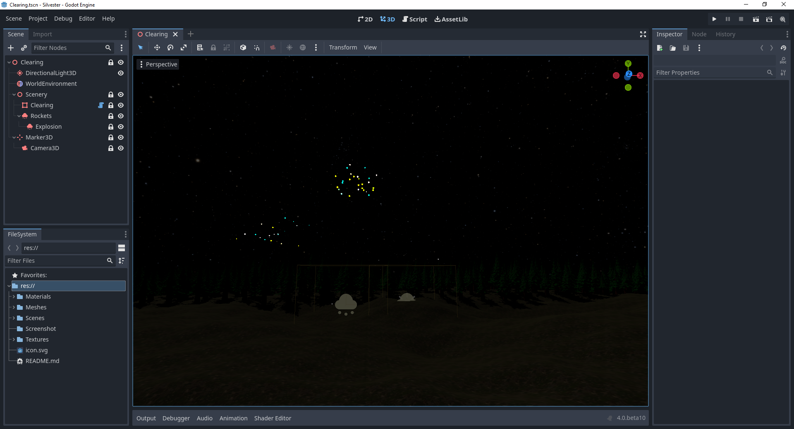

# Silvester Rockets 2022
Godot 4 Beta Demo

## About
This is a demo project for use with Godot 4.0. It's testet against the Beta 10 version.

This demo is build on the 31st of December 2022. It's only a simple particle effect and a dynamicly generated fixed scene. To test it on your own, simply add the missing texture (see below) and run the project.

## Used Textures:
The project uses the following textures:
- [Space HDRI](https://svs.gsfc.nasa.gov/4851) by NASA. Since I do not found the license, I do not include this texture in this project. Copy the downloaded file with the name `hiptyc_2020_4k.exr` into the `Textures` folder yourself.
- [Dirt Floor](https://polyhaven.com/a/coast_sand_rocks_02)
